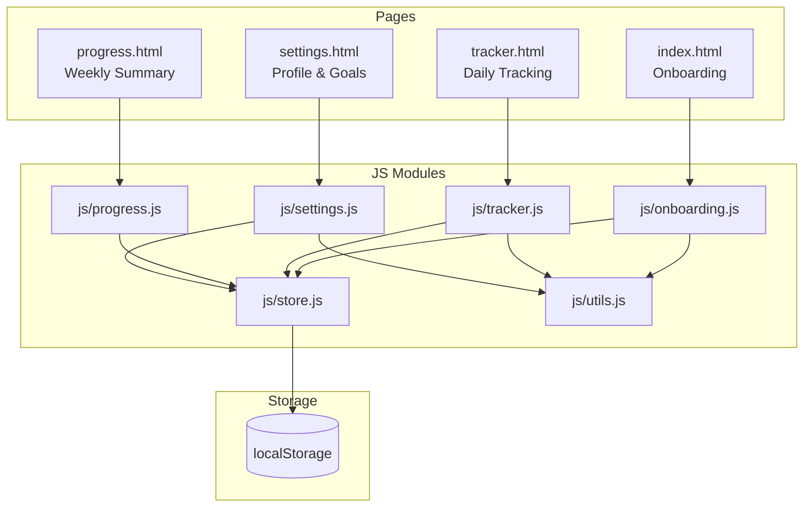

# Design Document: Nutrify

## Overview

Nutrify is a frontend-only, multi-page web application built with vanilla HTML, CSS, and JavaScript. It allows users to set up a personalized diet plan through an onboarding flow, track daily meal completion, visualize weekly progress, and adjust settings — all persisted in `localStorage` with no backend or build tooling required.

The app is organized around four dedicated HTML pages connected by standard anchor navigation. All shared logic lives in two JS modules (`store.js`, `utils.js`); each page has its own script. One `style.css` covers all pages using CSS custom properties and responsive breakpoints.

Key design goals:
- Clean separation between the data layer (`store.js`) and UI logic so the storage backend can be swapped later
- Responsive layout that works on mobile (single-column, bottom nav) and desktop (multi-column grid, top nav)
- Inline editing of meals without page navigation
- Personalized calorie recommendations via the Mifflin-St Jeor formula

---

## Architecture

### Module / Page Relationship



### Data Flow

1. On first visit, `index.html` / `onboarding.js` collects profile data, calls `utils.js` to compute the calorie goal, writes to `store.js`, then redirects to `tracker.html`.
2. `tracker.js` reads the Plan and Profile from the Store, renders the 7-day grid, and writes back on every meal add/edit/delete/toggle.
3. `progress.js` reads Plan + Profile from the Store (read-only) and renders the summary.
4. `settings.js` reads and writes Profile + Daily_Goal override to the Store.

---

## Components and Interfaces

### Page: `index.html` + `js/onboarding.js`

Responsibilities:
- Check Store for existing Profile on load; redirect to `tracker.html` if found
- Render a multi-step (or single-page scrolling) form collecting: goal, activity level, age, weight (with unit toggle kg/lbs), height (with unit toggle cm/ft+in), dietary preference
- Validate all fields inline before submission
- On submit: call `utils.computeGoal(profile)`, save Profile + Daily_Goal to Store, redirect

### Page: `tracker.html` + `js/tracker.js`

Responsibilities:
- Render day tabs (Mon–Sun); active day shown by default (based on current day of week)
- For each day: render meal list with checkbox, name, type badge, calorie count, edit/delete controls
- Inline meal form (add/edit): name input, meal-type select (with custom type option), calorie input
- Progress bar per day: consumed / goal, color change on exceed
- Day completion indicator (all meals checked)
- Toast notification when a day is fully completed
- Display suggested Daily_Goal vs user-overridden goal

### Page: `progress.html` + `js/progress.js`

Responsibilities:
- Weekly summary card: total consumed, total planned, days fully completed count
- Per-day breakdown: progress bar, percentage, consumed vs goal label
- Exceeded-goal color state on bars

### Page: `settings.html` + `js/settings.js`

Responsibilities:
- Display current Profile fields (editable)
- Allow override of Daily_Goal (numeric input)
- "Re-run onboarding" button: clears Profile from Store, redirects to `index.html`
- On save: write updated Profile + goal override to Store, recompute suggestion via `utils.computeGoal`

### `js/store.js` — Store Interface

```js
// Keys used in localStorage
const KEYS = {
  PROFILE:    'ddt_profile',
  PLAN:       'ddt_plan',
  GOAL:       'ddt_goal',          // user-overridden daily goal (number | null)
  THEME:      'ddt_theme',         // 'light' | 'dark'
  STREAK:     'ddt_streak',        // { count: number, lastCompletedDate: string | null }
  WEIGHT_LOG: 'ddt_weight_log',    // Array<{ date: string, weight: number }>
  // Water log keys are dynamic: 'ddt_water_YYYY-MM-DD' → number (0–8)
};

// Get a value by key; returns parsed object or defaultValue on missing/corrupt data
store.get(key, defaultValue)

// Set a value by key; serializes to JSON
store.set(key, value)

// Delete a value by key
store.delete(key)

// Convenience accessors (thin wrappers over get/set)
store.getProfile()              // → Profile | null
store.setProfile(profile)
store.getPlan()                 // → Plan | null
store.setPlan(plan)
store.getGoalOverride()         // → number | null
store.setGoalOverride(kcal)
store.clearAll()                // wipes all ddt_* keys (used by re-run onboarding)

// Theme
store.getTheme()                // → 'light' | 'dark' (default 'light')
store.setTheme(theme)

// Streak
store.getStreak()               // → { count: number, lastCompletedDate: string | null }
store.setStreak(streak)

// Water log (keyed by date string 'YYYY-MM-DD')
store.getWater(date)            // → number 0–8 (default 0)
store.setWater(date, count)

// Weight log
store.getWeightLog()            // → Array<{ date: string, weight: number }> (default [])
store.appendWeight(entry)       // upserts by date, maintains chronological order
```

Error handling: if `JSON.parse` throws, the Store logs a `console.warn`, calls `store.delete(key)`, and returns `defaultValue`.

### `js/utils.js` — Shared Utilities

```js
// Mifflin-St Jeor BMR + activity multiplier + goal adjustment
utils.computeGoal(profile)  // → number (kcal, rounded to nearest integer)

// Convert lbs → kg, ft/in → cm
utils.toKg(lbs)
utils.toCm(feet, inches)

// Clamp progress ratio 0–1 for progress bar width
utils.progressRatio(consumed, goal)  // → number 0–∞ (caller clamps to display)

// Generate default meal suggestions based on profile
utils.defaultMeals(profile)  // → Meal[][]  (array of 7 day-arrays)

// Returns today's date as a 'YYYY-MM-DD' string (used for water/weight log keys)
utils.todayKey()  // → string

// Returns a motivational tip for the given day index
// tips array has 14 entries; selection: tips[dayIndex % tips.length]
utils.getTip(dayIndex)  // → string

// Generates a pure-SVG path string for the weight log line chart
// entries must be sorted chronologically; returns an SVG <path d="..."> string
utils.formatWeightChartSVG(entries, width, height)  // → string

// Serialises the full 7-day Plan to a formatted plain-text string for clipboard copy.
// goalOverride (optional number) is used as the Daily_Goal label if provided;
// otherwise falls back to the goal stored on each day or the profile suggestion.
// Output contains exactly 7 day sections, each listing all meals with name, type, and calories.
utils.planToText(plan, goalOverride)  // → string
```

---

## Data Models

All data is stored as JSON in `localStorage`. Below are the canonical JS object shapes.

### Profile

```js
{
  goal: 'lose_weight' | 'maintain' | 'gain_muscle',
  activityLevel: 'sedentary' | 'lightly_active' | 'moderately_active' | 'very_active',
  age: number,           // years, integer
  weightKg: number,      // always stored in kg (converted on input if lbs)
  heightCm: number,      // always stored in cm (converted on input if ft/in)
  sex: 'male' | 'female',  // required for Mifflin-St Jeor
  dietaryPreference: 'none' | 'vegetarian' | 'vegan',
  createdAt: string,     // ISO 8601 timestamp
}
```

> Note: sex is required by the Mifflin-St Jeor formula (different constants for male/female). It must be added to the onboarding form.

### Meal

```js
{
  id: string,            // crypto.randomUUID() or Date.now().toString()
  name: string,
  type: string,          // e.g. 'Breakfast', 'Lunch', or any custom string
  calories: number,      // positive integer
  completed: boolean,
  note: string,          // free-text journal entry; default ''
}
```

### Day

```js
{
  dayIndex: number,      // 0 = Monday … 6 = Sunday
  meals: Meal[],
}
```

### Plan

```js
{
  days: Day[],           // always length 7, indices 0–6
  createdAt: string,     // ISO 8601 timestamp
  updatedAt: string,     // ISO 8601 timestamp, updated on every write
}
```

### GoalOverride

Stored as a plain `number` (kcal) or `null` under key `ddt_goal`. Not a nested object — just a primitive serialized as JSON.

### WeightEntry

```js
{
  date: string,    // 'YYYY-MM-DD'
  weight: number,  // positive number in the unit matching Profile (kg or lbs)
}
```

### Streak

```js
{
  count: number,                  // consecutive completed days; 0 if no streak
  lastCompletedDate: string | null,  // 'YYYY-MM-DD' of the last fully-completed day
}
```

---

## Recommendation Engine

### Mifflin-St Jeor Formula

**BMR calculation** (implemented in `utils.computeGoal`):

```
Male:   BMR = (10 × weightKg) + (6.25 × heightCm) − (5 × age) + 5
Female: BMR = (10 × weightKg) + (6.25 × heightCm) − (5 × age) − 161
```

**Activity multipliers:**

| activityLevel        | Multiplier |
|----------------------|------------|
| sedentary            | 1.2        |
| lightly_active       | 1.375      |
| moderately_active    | 1.55       |
| very_active          | 1.725      |

**Maintenance calories** = BMR × multiplier

**Goal adjustments:**

| goal          | Adjustment        |
|---------------|-------------------|
| lose_weight   | maintenance − 500 |
| maintain      | maintenance       |
| gain_muscle   | maintenance + 300 |

Result is rounded to the nearest integer.

### Default Meal Suggestions

`utils.defaultMeals(profile)` returns a 7-element array (one per day) of `Meal[]`. Meals are selected from a small built-in lookup table keyed by `dietaryPreference`. Each day gets 4 meals (Breakfast, Lunch, Snack, Dinner) with calorie values scaled proportionally to the computed Daily_Goal. These are suggestions only — the user can edit or delete them freely.

---

## Page-by-Page UI Layout

### `index.html` — Onboarding

```
┌─────────────────────────────────┐
│  App logo / title               │
│                                 │
│  [Step indicator: 1 of 3]       │  ← optional multi-step UX
│                                 │
│  Goal selection (radio cards)   │
│  Activity level (radio cards)   │
│  Age / Weight / Height inputs   │
│  Sex (radio)                    │
│  Dietary preference (radio)     │
│                                 │
│  Inline validation messages     │
│                                 │
│  [Get Started →]                │
└─────────────────────────────────┘
```

No Nav bar on this page.

### `tracker.html` — Daily Tracking

Mobile (< 768px):
```
┌─────────────────────────────────┐
│  🔥 Streak: 4 days              │  ← streak badge in header
│  Day tabs: M T W T F S S        │
│  ─────────────────────────────  │
│  💡 Tip: "Drink water first…"   │  ← motivational tip card
│  ─────────────────────────────  │
│  [Day name] — Goal: 1800 kcal   │
│  Suggested: 1800 | Override: –  │
│  Remaining: 600 kcal            │  ← calories remaining (red if negative)
│  Progress bar ████░░░ 1200/1800 │
│  ✓ Day complete badge           │
│  ⚠ Over budget! (if exceeded)   │  ← warning message                    │
│                                 │
│  💧💧💧💧💧💧💧💧  (4/8 filled) │  ← water tracker row
│                                 │
│  ☐ Breakfast · Oatmeal  350cal  │  [edit] [×]
│    ▶ Note  [_______________]    │  ← collapsible note textarea
│  ☑ Lunch · Salad        450cal  │  [edit] [×]
│    ▶ Note  [_______________]    │
│  ☐ Snack · Apple        100cal  │  [edit] [×]
│    ▶ Note  [_______________]    │
│                                 │
│  [+ Add Meal]                   │
│  ─────────────────────────────  │
│  [Inline add/edit form]         │
│  Name: ______  Type: [select▼]  │
│  Calories: ____  [Save] [Cancel]│
│                                 │
│  [Download Plan PDF]            │  ← triggers window.print() + clipboard copy
│                                 │
│  ════ Bottom Nav ════           │
│  Tracker | Progress | Settings  │  ← includes 🌙 dark mode toggle
└─────────────────────────────────┘
```

Desktop (≥ 768px): 7-column grid, one column per day, top nav (with dark mode toggle).

### `progress.html` — Weekly Summary

```
┌─────────────────────────────────┐
│  Top Nav (with 🌙 toggle)       │
│  ─────────────────────────────  │
│  Weekly Summary                 │
│  Total consumed: 8,400 kcal     │
│  Total planned:  12,600 kcal    │
│  Days completed: 3 / 7          │
│  Avg daily intake: 1,680 kcal   │  ← weekly calorie average card
│                                 │
│  Mon  ████████░░  67%  1200/1800│
│  Tue  ██████████ 100%  1800/1800│  ← completed color
│  Wed  ████████████ 110% 1980/1800│  ← exceeded color
│  ...                            │
│                                 │
│  [Print / Export]               │  ← export button
│  ─────────────────────────────  │
│  Body Weight Log                │
│  Today's weight: [____] kg      │  ← number input
│  [Log Weight]                   │
│                                 │
│  [SVG line chart of weight log] │  ← pure SVG, no library
└─────────────────────────────────┘
```

### `settings.html` — Profile & Goals

```
┌─────────────────────────────────┐
│  Top Nav (with 🌙 toggle)       │
│  ─────────────────────────────  │
│  Profile                        │
│  Goal: [select]                 │
│  Activity: [select]             │
│  Age / Weight / Height          │
│  Dietary preference: [select]   │
│                                 │
│  Calorie Goal                   │
│  Suggested: 1800 kcal           │
│  Override: [____] kcal          │
│                                 │
│  Appearance                     │
│  Dark Mode: [🌙 Toggle]         │  ← dark mode toggle
│                                 │
│  [Save Changes]                 │
│  [Re-run Onboarding]            │
└─────────────────────────────────┘
```

---

## Navigation Design

### Structure

The Nav is present on `tracker.html`, `progress.html`, and `settings.html`. It is absent on `index.html`.

Nav links (always anchor elements):
- Tracker → `tracker.html`
- Progress → `progress.html`
- Settings → `settings.html`

Active state: each page's JS adds a `.nav--active` class to the matching `<a>` on load.

### Responsive Behavior

| Viewport       | Nav position | Layout         |
|----------------|--------------|----------------|
| < 768px        | Bottom fixed | Icon + label   |
| ≥ 768px        | Top fixed    | Horizontal bar |

Bottom nav uses `position: fixed; bottom: 0` with `padding-bottom` on `<main>` to prevent content overlap. Top nav uses `position: sticky; top: 0`.

### HTML Structure (shared partial, inlined per page)

```html
<nav class="nav" aria-label="Main navigation">
  <a href="tracker.html" class="nav__link" data-page="tracker">
    <span class="nav__icon" aria-hidden="true">📋</span>
    <span class="nav__label">Tracker</span>
  </a>
  <a href="progress.html" class="nav__link" data-page="progress">
    <span class="nav__icon" aria-hidden="true">📊</span>
    <span class="nav__label">Progress</span>
  </a>
  <a href="settings.html" class="nav__link" data-page="settings">
    <span class="nav__icon" aria-hidden="true">⚙️</span>
    <span class="nav__label">Settings</span>
  </a>
</nav>
```

---

## CSS Architecture

### Custom Properties (`:root`) and Dark Mode

```css
:root {
  /* Colors */
  --color-primary:      #4CAF50;
  --color-primary-dark: #388E3C;
  --color-danger:       #E53935;
  --color-warning:      #FB8C00;
  --color-surface:      #FFFFFF;
  --color-bg:           #F5F5F5;
  --color-text:         #212121;
  --color-text-muted:   #757575;
  --color-border:       #E0E0E0;

  /* Progress bar states */
  --color-progress-normal:   var(--color-primary);
  --color-progress-exceeded: var(--color-danger);
  --color-progress-complete: var(--color-primary-dark);

  /* Spacing scale */
  --space-xs:  4px;
  --space-sm:  8px;
  --space-md:  16px;
  --space-lg:  24px;
  --space-xl:  32px;

  /* Typography */
  --font-family: 'Inter', sans-serif;   /* Google Fonts */
  --font-size-sm:   0.875rem;
  --font-size-base: 1rem;
  --font-size-lg:   1.125rem;
  --font-size-xl:   1.5rem;

  /* Radius */
  --radius-sm: 4px;
  --radius-md: 8px;
  --radius-lg: 16px;

  /* Nav */
  --nav-height-mobile: 60px;
  --nav-height-desktop: 56px;
}

/* Dark mode overrides — applied when <body data-theme="dark"> */
[data-theme="dark"] {
  --color-surface:    #1E1E1E;
  --color-bg:         #121212;
  --color-text:       #E0E0E0;
  --color-text-muted: #9E9E9E;
  --color-border:     #333333;
  --color-primary:    #66BB6A;
  --color-primary-dark: #43A047;
}
```

### Breakpoints

```css
/* Mobile-first base styles apply to all viewports */

/* Desktop breakpoint */
@media (min-width: 768px) {
  /* Multi-column grid, top nav, wider inputs */
}
```

### Print Stylesheets

`style.css` contains two separate `@media print` blocks, each scoped to its own page via a body class:

- `body.page-progress @media print` — weekly summary print view (Requirement 17): hides Nav, renders a text-only summary of consumed/planned calories and per-day breakdown.
- `body.page-tracker @media print` — full 7-day plan print view (Requirement 19): hides Nav, day tabs, checkboxes, edit/delete controls, water tracker, streak badge, and all interactive elements; renders all 7 days in a stacked layout with day name, Daily_Goal, and each Meal's name, Meal_Type, and calorie count.

Both pages use a `.no-print` class on elements to hide in print and a `.print-only` class on elements that are hidden in screen view but visible in print.

### Shared Component Classes

| Class | Purpose |
|---|---|
| `.btn` | Base button (padding, radius, cursor) |
| `.btn--primary` | Green filled CTA |
| `.btn--ghost` | Outline/text button |
| `.btn--danger` | Red destructive action |
| `.card` | White surface with shadow and radius |
| `.progress-bar` | Container track |
| `.progress-bar__fill` | Animated fill, width set via inline style |
| `.progress-bar__fill--exceeded` | Red state |
| `.progress-bar__fill--complete` | Dark green state |
| `.form-group` | Label + input + error message wrapper |
| `.form-error` | Inline validation message (red, small) |
| `.meal-item` | Single meal row (flex, gap, min-height 44px) |
| `.meal-item--completed` | Strikethrough + muted color |
| `.meal-note` | Collapsible textarea below a meal item |
| `.day-tab` | Day selector tab button |
| `.day-tab--active` | Active day highlight |
| `.day-grid` | Desktop 7-column grid container |
| `.nav` | Navigation bar base |
| `.nav__link` | Nav anchor (flex column, icon + label) |
| `.nav--active` | Active page highlight on nav link |
| `.toast` | Floating notification (position fixed, animated) |
| `.badge` | Meal type label pill |
| `.calories-remaining` | Prominent remaining-calories display |
| `.calories-remaining--over` | Red variant when calories remaining is negative |
| `.streak-badge` | Header badge showing consecutive-day streak count |
| `.tip-card` | Motivational tip display at top of tracker page |
| `.water-tracker` | Container row for the 8 water drop icons |
| `.water-drop` | Individual water drop icon (unfilled state) |
| `.water-drop--filled` | Filled/active state for a water drop |
| `.weight-chart` | Container for the SVG weight log line chart |

### Responsive Grid (tracker.html desktop)

```css
@media (min-width: 768px) {
  .day-grid {
    display: grid;
    grid-template-columns: repeat(7, 1fr);
    gap: var(--space-md);
  }
}
```

On mobile, `.day-grid` shows only the active day (others `display: none` via JS toggling `.day-tab--active`).

---

## Correctness Properties

*A property is a characteristic or behavior that should hold true across all valid executions of a system — essentially, a formal statement about what the system should do. Properties serve as the bridge between human-readable specifications and machine-verifiable correctness guarantees.*


### Property 1: Calorie Goal Formula Correctness

*For any* valid profile (any combination of sex, age, weightKg, heightCm, activityLevel, and goal), `utils.computeGoal(profile)` should return the integer result of the Mifflin-St Jeor BMR multiplied by the activity multiplier and adjusted by the goal offset (−500 for lose_weight, 0 for maintain, +300 for gain_muscle), rounded to the nearest integer.

**Validates: Requirements 1.3, 4.3, 4.4, 4.5**

---

### Property 2: Invalid Onboarding Submission Rejected

*For any* onboarding form submission where at least one required field is empty or missing, the submission handler should return an error state (not proceed to save/redirect) and the store should remain unchanged.

**Validates: Requirements 1.6**

---

### Property 3: Meal List Mutation Correctness

*For any* day and any valid meal object, adding the meal should increase that day's meal count by exactly one and the meal should appear in the list; deleting any meal should decrease the count by one and remove it; editing a meal's fields should update only that meal and leave all others unchanged.

**Validates: Requirements 2.1, 2.3, 2.4**

---

### Property 4: Consumed Calories Invariant

*For any* day's meal list, the consumed calorie total displayed (and used for the progress bar) should always equal the sum of `calories` for all meals where `completed === true`.

**Validates: Requirements 2.6, 3.2, 3.6**

---

### Property 5: Calorie Input Validation

*For any* calorie input value that is non-numeric, negative, or zero, the meal save operation should be rejected and the meal's stored calorie value should remain unchanged.

**Validates: Requirements 2.7**

---

### Property 6: Plan Round-Trip Serialization

*For any* valid Plan object (with any combination of days, meals, completion states, and timestamps), calling `store.set('ddt_plan', plan)` followed by `store.get('ddt_plan', null)` should return an object deeply equal to the original Plan.

**Validates: Requirements 6.4, 2.8, 3.5**

---

### Property 7: Corrupted Store Data Returns Safe Default

*For any* key in the store where the raw localStorage value is not valid JSON (e.g. truncated string, `undefined`, binary garbage), `store.get(key, defaultValue)` should return `defaultValue` without throwing, and the corrupted entry should be removed from localStorage.

**Validates: Requirements 6.5**

---

### Property 8: Exceeded Goal Triggers Color Change

*For any* day where consumed calories (sum of completed meal calories) exceed the Daily_Goal, the progress bar element should have the `--exceeded` modifier class applied; for any day where consumed calories are at or below the goal, the modifier should not be present.

**Validates: Requirements 7.2**

---

### Property 9: Weekly Summary Aggregation Correctness

*For any* Plan, the weekly summary values (total consumed, total planned, days completed count) should equal the arithmetic sum of the corresponding per-day values across all 7 days — total consumed = Σ consumed per day, total planned = Σ Daily_Goal × 7, days completed = count of days where all meals are checked.

**Validates: Requirements 7.3, 7.5**

---

### Property 10: Nav Active State Matches Current Page

*For any* page load on tracker, progress, or settings, exactly one nav link should have the `.nav--active` class applied, and it should be the link whose `href` matches the current page filename.

**Validates: Requirements 8.3**

---

### Property 11: Default Meal Suggestions Respect Dietary Preference

*For any* profile with `dietaryPreference` of `vegetarian` or `vegan`, none of the meals returned by `utils.defaultMeals(profile)` should contain ingredients flagged as non-compliant (meat for vegetarian; any animal product for vegan). For `none`, any meal is valid.

**Validates: Requirements 4.1**

---

### Property 12: Calories Remaining Invariant

*For any* day, `Calories_Remaining` should always equal `Daily_Goal − sum of calories for all meals where completed === true`. This value may be negative when consumed exceeds the goal.

**Validates: Requirements 9.1, 9.2, 9.3**

---

### Property 13: Exceeded Goal Warning State

*For any* day where consumed calories exceed the Daily_Goal, both the red progress bar state and the warning message should be present; for any day where consumed calories are at or below the goal, neither should be present.

**Validates: Requirements 10.1, 10.2, 10.3**

---

### Property 14: Dark Mode Preference Persists Across Page Loads

*For any* theme value ('light' or 'dark') written via `store.setTheme(theme)`, a subsequent `store.getTheme()` call (including after a simulated page reload by re-reading from localStorage) should return the same value.

**Validates: Requirements 11.4, 11.5**

---

### Property 15: Streak Increments on Consecutive Completion, Resets on Gap

*For any* sequence of day-completion events, if the date of the current completion is exactly one calendar day after `lastCompletedDate`, the streak count should increase by 1; if the gap is greater than one day, the streak count should reset to 1.

**Validates: Requirements 13.2, 13.3**

---

### Property 16: Water Log Resets on New Day

*For any* date `D`, `store.getWater(D)` should return 0 if no water has been logged for `D`, regardless of what was logged for any other date. Water counts for different dates are fully independent.

**Validates: Requirements 14.3, 14.4**

---

### Property 17: Weight Log Chronological Order

*For any* sequence of `store.appendWeight(entry)` calls with arbitrary dates, `store.getWeightLog()` should always return entries sorted in ascending date order, and at most one entry per date (upsert semantics).

**Validates: Requirements 18.2, 18.3, 18.5**

---

### Property 18: Weekly Calorie Average Excludes Empty Days

*For any* Plan, the weekly average displayed on `progress.html` should equal `Σ consumed per day / count of days with at least one checked meal`. Days with zero checked meals must not be included in the denominator. When no days have checked meals, the result should be 0 (no division by zero).

**Validates: Requirements 16.1, 16.2, 16.3**

---

### Property 19: Plan Plain-Text Export Contains All 7 Days and Meals

*For any* Plan with 7 days, `utils.planToText(plan, goalOverride)` should return a string containing exactly 7 day sections. Each section should list all meals for that day, and for every meal the output should include the meal name, Meal_Type, and calorie count. No day section should be omitted even if it has zero meals.

**Validates: Requirements 19.6**

---

## Error Handling

### Store Errors

- **Corrupted JSON**: `store.get` wraps `JSON.parse` in try/catch. On failure: `console.warn('Store: corrupted data for key ' + key)`, `localStorage.removeItem(key)`, return `defaultValue`.
- **Missing key**: `localStorage.getItem` returns `null`; store returns `defaultValue` directly.
- **Quota exceeded**: `store.set` wraps `localStorage.setItem` in try/catch. On `QuotaExceededError`: `console.error('Store: storage quota exceeded')`, does not throw (silent fail with warning).

### Form Validation Errors

- **Onboarding**: Each required field validated on submit. Missing fields get an adjacent `.form-error` element with a descriptive message. Form does not proceed until all fields are valid.
- **Calorie input**: Validated on blur and on save. Rejects: non-numeric strings, values ≤ 0, values > 9999 (reasonable upper bound). Shows `.form-error` inline.
- **Meal name**: Must be non-empty after trimming whitespace.

### Navigation / Redirect Errors

- If `tracker.html` is loaded and no Plan exists in the store (e.g. store was cleared), `tracker.js` initializes a fresh Plan with empty days and saves it.
- If `progress.html` or `settings.html` is loaded with no Profile, the page renders a prompt to complete onboarding with a link to `index.html`.

### Data Integrity

- All writes to the store go through `store.set`, which always serializes to JSON. No partial writes.
- `updatedAt` on the Plan is refreshed on every `store.setPlan` call.

---

## Testing Strategy

### Dual Testing Approach

Both unit tests and property-based tests are required. They are complementary:
- Unit tests catch concrete bugs with specific known inputs and verify integration points
- Property-based tests verify universal correctness across the full input space

### Property-Based Testing

**Library**: [fast-check](https://github.com/dubzzz/fast-check) (no build tools needed — can be loaded via a single `<script>` tag in test HTML, or run via Node with `node --experimental-vm-modules`)

**Configuration**: Each property test runs a minimum of **100 iterations** (fast-check default is 100; set explicitly via `{ numRuns: 100 }`).

**Tag format** (comment above each test):
```
// Feature: 7-day-diet-tracker, Property N: <property_text>
```

Each correctness property from the design document maps to exactly one property-based test:

| Design Property | Test description |
|---|---|
| Property 1 | Generate random profiles, assert `computeGoal` output matches formula |
| Property 2 | Generate form states with ≥1 empty field, assert submission rejected |
| Property 3 | Generate days + meals, assert add/edit/delete mutations are correct |
| Property 4 | Generate meal lists with random completion states, assert consumed total = Σ completed calories |
| Property 5 | Generate invalid calorie strings/numbers, assert save rejected |
| Property 6 | Generate Plan objects, assert store round-trip deep equality |
| Property 7 | Generate invalid JSON strings, assert store returns default without throwing |
| Property 8 | Generate days with consumed vs goal values, assert exceeded class presence |
| Property 9 | Generate Plans, assert weekly summary = Σ per-day values |
| Property 10 | For each page, assert exactly one nav link has active class |
| Property 11 | Generate profiles with dietary preferences, assert meal suggestions are compliant |
| Property 12 | Generate meal lists + goals, assert calories remaining = goal − Σ completed calories |
| Property 13 | Generate consumed/goal pairs, assert warning + red bar present iff consumed > goal |
| Property 14 | Write theme to store, simulate reload, assert same theme is read back |
| Property 15 | Generate completion date sequences, assert streak increments or resets correctly |
| Property 16 | Generate water logs for multiple dates, assert counts are independent per date |
| Property 17 | Generate weight entries in random order, assert log is sorted and upserts correctly |
| Property 18 | Generate Plans with varying completion states, assert average excludes empty days |
| Property 19 | Generate Plans with arbitrary meals per day, assert `planToText` output has exactly 7 day sections each listing all meals with name, type, and calories |

### Unit Tests

**Framework**: Plain `assert` or a lightweight library like [uvu](https://github.com/lukeed/uvu) (single file, no build needed).

Unit tests focus on:
- Specific formula examples for `computeGoal` (known BMR values from published tables)
- Onboarding redirect logic (profile exists → redirect, no profile → show form)
- Store error handling with specific corrupted inputs (`"{"`, `"null"`, `""`)
- Toast notification trigger when last meal in a day is checked
- Nav active class applied correctly on each page
- Progress bar percentage calculation edge cases (0 meals, goal = 0)

### Test File Structure

```
tests/
  unit/
    utils.test.js       ← computeGoal, toKg, toCm, progressRatio, getTip, formatWeightChartSVG
    store.test.js       ← get/set/delete, error handling, theme, streak, water, weight log
    tracker.test.js     ← meal add/edit/delete logic, streak updates, water log
    progress.test.js    ← weekly summary aggregation, calorie average, weight log
  property/
    utils.prop.js       ← Properties 1, 11, 12, 19
    store.prop.js       ← Properties 6, 7, 14, 16, 17
    tracker.prop.js     ← Properties 2, 3, 4, 5, 13, 15
    progress.prop.js    ← Properties 8, 9, 18
    nav.prop.js         ← Property 10
```
